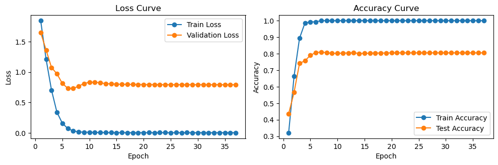

# The Basic version of Graph-Bert Model


Architecture of the GRAPH-BERT Model. (Part 1: linkless subgraph batching; Part 2: node input vector embeddings and graph transformer based encoder; Part 3: representation fusion and functional component depending on the target application task, the function component will generate different output (We also include the residual terms for reviving deep learning)


----------------------------------------------------------
## How to run the code?

1. Environment settings:

To build the Docker image for the project based on docker file which we provided, run the following command in the project directory

```bash

docker build -t your-image-name 

``` 


2. In our scripts, we provide two ways to run it:

(1). JupyterLab: 

To run the script, simply execute the <ins>GBert_cora_full_procedure.ipynb</ins> notebook. This script works independently, without requiring any external file support.

(2). Python:

To run a script, 

```bash
python3 main_py.py

```

 (3). GCP Cloud running

 example:
 
docker build -t myapp:latest -f Dockerfile_cpu https://github.com/txgxp88/GraphBert.git

PROJECT_ID=$XXXX
REGION=$XXXX
REPO=my-repo

(1) create artifactory for image container:

gcloud artifacts repositories create $my-repo \
    --repository-format=docker \
    --location=$us-central1

(2) Push:

docker tag myapp:latest $REGION-docker.pkg.dev/$PROJECT_ID/$REPO/myapp:latest

docker push $REGION-docker.pkg.dev/$PROJECT_ID/$REPO/myapp:latest

(3) Validate:

gcloud artifacts docker images list us-central1-docker.pkg.dev/$PROJECT_ID/my-repo

(4) running:

IMAGE_URI=us-central1-docker.pkg.dev/$PROJECT_ID/my-repo/myapp:latest

gcloud ai custom-jobs create \
  --region=$REGION \
  --display-name=graphbert-job \
  --worker-pool-spec=machine-type=n1-standard-4,replica-count=1,container-image-uri=$IMAGE_URI \
  --command="python" \
  --args="main.py"

(5) check:

gcloud ai custom-jobs stream-logs projects

or on the training GUI from Vertex AI

----------------------------------------------------------
## The procedure of our code?

(1) Data Fetching and Processing: In this step, we use a simple example Cora dataset to demonstrate the entire pipeline using the script <ins>step_1_processing.py</ins>.

(2) Graph-Bert Model Input preparation: (a) Node WL Code. (b) Intimacy-based Subgraph Batch. (c) Node Hop Distance. These inputs can be computed using the script <ins>script_2_subgraph.py</ins>.

(3) Graph-Bert parameters setting and data preparations: it is handled by <ins>script_3_setting.py</ins> and <ins>step_4_classification.py</ins>.

(4) Pretraining and Fine-tuning tasks for node classification check out our <ins>main_py.py</ins>. This script serves as the entry point for running the model.


----------------------------------------------------------
## Performance 



----------------------------------------------------------
### Following work

Based on this basic version, we have carried out the following work and applied it to Medical MRI imaging applications
it is located in the another project [folder](https://github.com/txgxp88/GraphBert_MApp)


----------------------------------------------------------
### Paper References from previous work
Graph-Bert: Only Attention is Needed for Learning Graph Representations
Paper URL at arXiv: https://arxiv.org/abs/2001.05140
